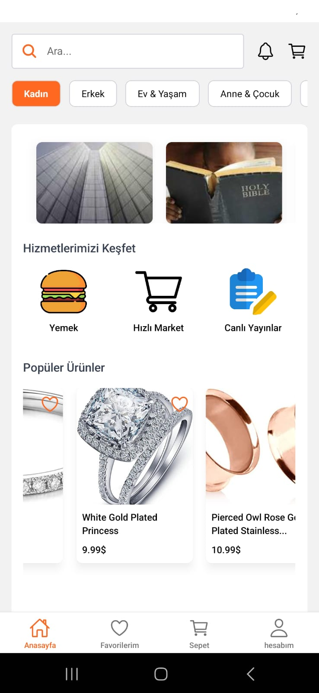
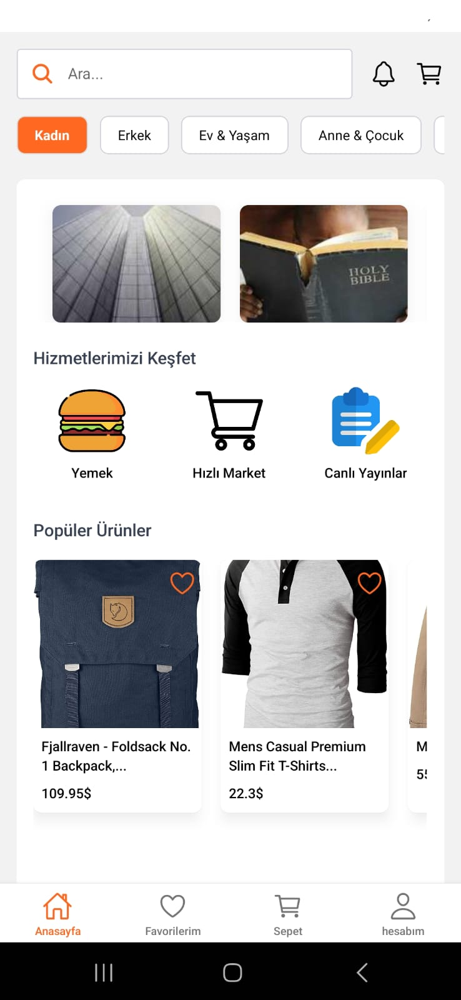
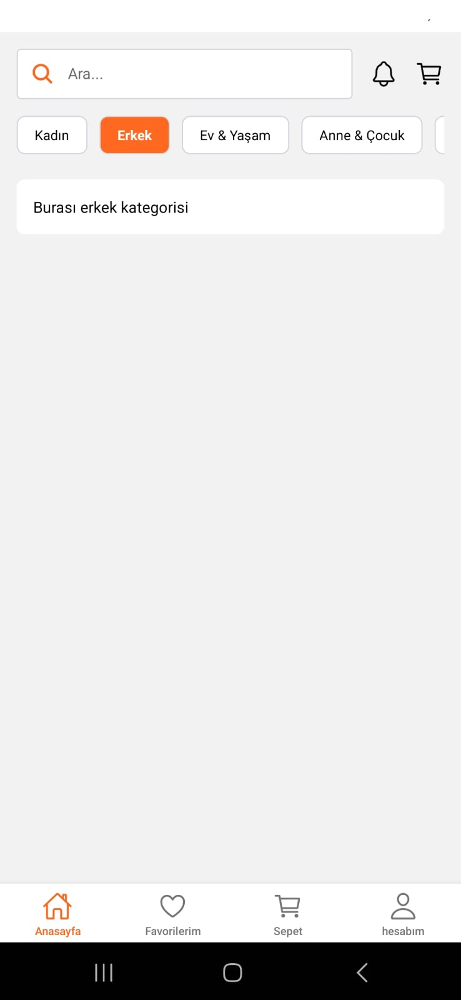
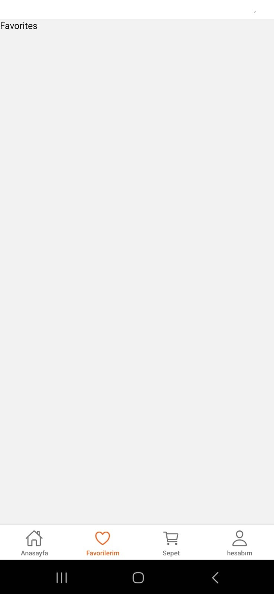
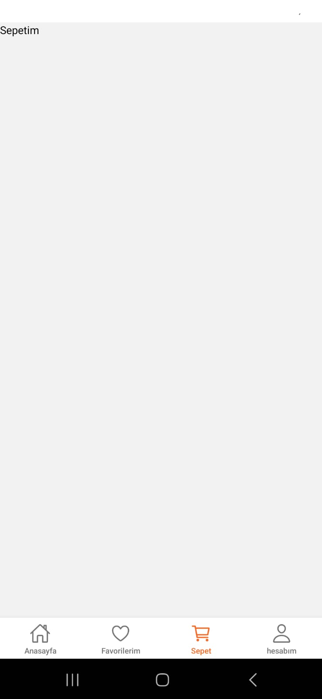
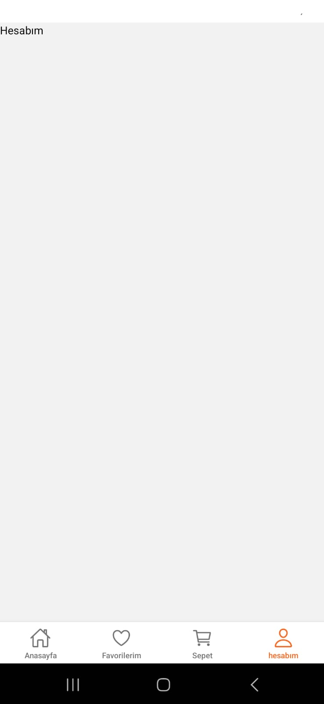

# E-Ticaret Uygulaması
##  Özellikler

- **Popüler Ürünler:** Yatay kaydırmalı liste üzerinden popüler ürünler görüntülenir.
- **Kategorilere Göz Atma:** Kullanıcılar, farklı kategorilerdeki ürünlere hızlı erişim sağlayabilir.
- **Favorilere Ekleme:** Kullanıcılar beğendikleri ürünleri favorilerine ekleyebilir.
- **Dinamik API Kullanımı:** Ürün verileri **Fake Store API** üzerinden çekilmektedir.
- **Modern Tasarım:** NativeWind ile modern ve özelleştirilebilir tasarım.
## Kullanılan Teknolojiler

- **React Native:** Mobil uygulama geliştirme.
- **Expo:** Hızlı geliştirme ve test ortamı.
- **NativeWind:** Tailwind CSS uyumlu modern tasarım.
- **Fake Store API:** Ürün verileri için kullanılan API.
- **Ionicons:** Uygulama içi ikonlar.

##  Ekran Görüntüleri

### Ana Sayfa

### Kategoriler

### Sayfalar

